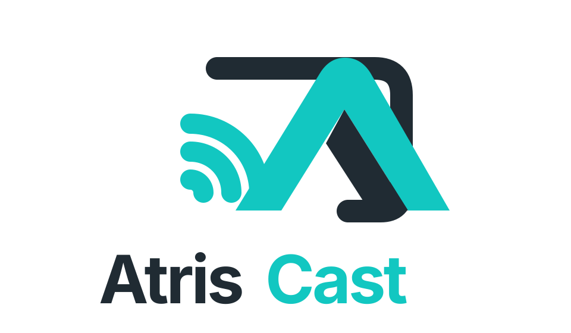
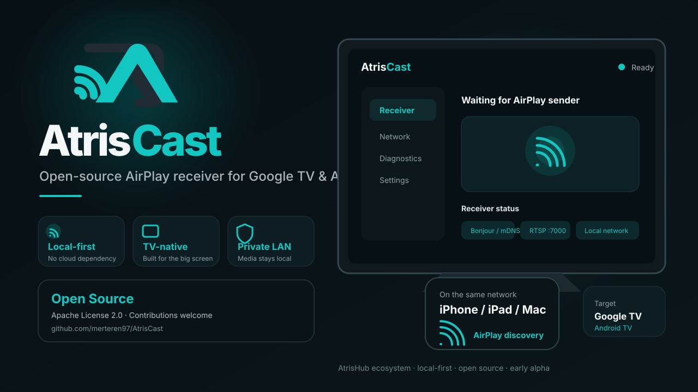

# AtrisCast

<p align="center">
  
</p>

<p align="center">
  <strong>Open-source, local-first AirPlay receiver for Google TV and Android TV.</strong>
</p>

<p align="center">
  <a href="LICENSE"></a>
  
  
</p>

<p align="center">
  
</p>

<p align="center"><sub>Concept preview. The interface and receiver capabilities will evolve as protocol support is implemented.</sub></p>

**AtrisCast** is an open-source, local-first casting receiver for Google TV and Android TV.
The project is part of the **AtrisHub** ecosystem, but the application itself is intentionally standalone: **no AtrisHub account, login, cloud service, telemetry, or remote backend is required to run the receiver.**

> Project status: **early alpha / real-device protocol validation**. Alpha05 adds the first complete screen-mirroring video path: FairPlay session-key handling, encrypted type-110 mirror packet processing, H.264 extraction, Android hardware decoding and full-screen Surface rendering. This path is implemented and CI-tested but still requires validation across real iPhone/iPad/macOS and Google TV firmware combinations.

## Why AtrisCast?

Many Google TV devices do not expose AirPlay receiving as a platform feature. AtrisCast explores a clean, Android-native receiver architecture focused on local-network discovery, low-latency media pipelines and a TV-first user experience.

## Current alpha capabilities

- Google TV / Android TV launcher application
- local-only foreground receiver service
- `_airplay._tcp` and `_raop._tcp` discovery
- persistent local receiver identity without exposing the hardware MAC address
- AirPlay control endpoint on TCP 7000
- binary-plist `GET /info` capability response
- FairPlay `POST /fp-setup` phase 1 / phase 2 negotiation
- binary-plist `SETUP` transport negotiation
- local UDP timing channel
- type-110 mirror TCP packet parser
- FairPlay session-key decryption through a separately licensed native bridge
- AES-CTR mirror stream processing and AVCC-to-Annex-B H.264 conversion
- Android `MediaCodec` H.264 hardware decode to a live `SurfaceView`
- automatic full-screen playback UI while a mirror stream is active
- decoder re-attachment when Android recreates the rendering Surface
- mirror diagnostics for bytes received, rendered frames, output resolution and decode errors
- type-96 audio UDP data/control listeners and type-103 buffered-audio transport bring-up
- `RECORD`, `FLUSH`, `GET_PARAMETER`, `SET_PARAMETER`, `TEARDOWN`, `/feedback` and `/audioMode` control acknowledgements
- English and Turkish TV interface, with English as the default

Audio decode/playback and broader sender/firmware compatibility remain under development.

## Build requirements

- Android Studio / Android SDK 37.1
- JDK 17
- Gradle 9.5+
- Android NDK `27.2.12479018`
- Rust toolchain compatible with the pinned native dependency
- `cargo-ndk` 4.1.2

The standard build compiles a replaceable LGPL FairPlay JNI shared library for Android. The build fetches the pinned `shairplay-rust` source revision and packages its license notices into the APK. For protocol/UI development where encrypted mirroring is intentionally unavailable, the native component can be skipped with:

```bash
gradle assembleDebug -PskipFairPlayNative=true
```

A build made with that flag can negotiate AirPlay transport but cannot decrypt or display encrypted screen-mirroring video.

## Development status

AtrisCast is not yet a production-ready AirPlay receiver. Compatibility is being developed incrementally against real Apple-device handshakes. The Diagnostics page records the latest protocol and video stage so real-device regressions can be isolated without exposing technical detail on the normal Home screen.

## Brand assets

Repository-safe vector brand assets live under [`assets/`](assets/):

- [`atriscast-logo.svg`](assets/atriscast-logo.svg) — primary AtrisCast product logo
- [`atriscast-preview.svg`](assets/atriscast-preview.svg) — repository / README preview artwork

## Compatibility note

AtrisCast is designed to run entirely on the local network. It does not require an AtrisHub login or cloud connection and does not send casting traffic to an AtrisHub backend.

## Licensing

The Android/Kotlin AtrisCast application is licensed under Apache License 2.0. The FairPlay JNI bridge is intentionally isolated as a replaceable native component and includes LGPL-3.0-or-later code from the pinned `shairplay-rust` dependency. See `THIRD_PARTY_NOTICES.md` for the exact boundary and revision.

## Project

AtrisCast is an independent open-source project in the AtrisHub ecosystem.

- Website: `atrishub.com`
- License: Apache License 2.0 (see `LICENSE`)
- Third-party notices: see `THIRD_PARTY_NOTICES.md`

AirPlay, iPhone, iPad, Mac and Apple TV are trademarks of Apple Inc. AtrisCast is not affiliated with, endorsed by, or sponsored by Apple Inc.
